# ForgeLLM Architecture

## Overview

ForgeLLM is designed as a modular system for continued pre-training and instruction fine-tuning of large language models. The architecture is built around several key components that work together to provide a complete solution for model training, evaluation, and inference.

## Updated Architecture

```mermaid
graph TD
    A["🎯 ForgeLLM Project Structure"] --> B["📦 Package Code"]
    A --> C["📁 Data Directories"]
    A --> D["📄 Configuration Files"]
    
    B --> E["forgellm/"]
    E --> F["__main__.py<br/>🔥 python -m forgellm"]
    E --> G["cli/<br/>📱 Command Line Interface"]
    E --> H["server/<br/>🖥️ Model Server"]
    E --> I["web/<br/>🌐 Web Interface"]
    E --> J["api/<br/>🔌 API Routes"]
    E --> K["models/<br/>🤖 Model Management"]
    E --> L["training/<br/>🚀 Training Pipeline"]
    E --> M["utils/<br/>🛠️ Utilities"]
    
    G --> G1["main.py<br/>forgellm-cli entry point"]
    H --> H1["main.py<br/>forgellm-server entry point"]
    I --> I1["main.py<br/>forgellm-web entry point"]
    
    C --> N["models/<br/>📂 Trained Models"]
    C --> O["dataset/<br/>📂 Training Datasets"]
    C --> P["data/<br/>📂 Processed Data"]
    
    D --> Q["pyproject.toml<br/>⚙️ Package Configuration"]
    D --> R["README.md<br/>📖 Documentation"]
    D --> S["LICENSE<br/>⚖️ License"]
    
    style A fill:#e1f5fe
    style B fill:#f3e5f5
    style C fill:#e8f5e8
    style D fill:#fff3e0
    style F fill:#ffcdd2
    style G1 fill:#ffcdd2
    style H1 fill:#ffcdd2
    style I1 fill:#ffcdd2
```


## System Components

```
┌─────────────────────────────────────────────────────────────────┐
│                         Web Interface                           │
│                                                                 │
│  ┌───────────────┐    ┌───────────────┐    ┌───────────────┐    │
│  │    Training   │    │   Monitoring  │    │    Testing    │    │
│  │      Tab      │    │      Tab      │    │      Tab      │    │
│  └───────────────┘    └───────────────┘    └───────────────┘    │
└─────────────────────────────────────────────────────────────────┘
               │                 │                  │
               ▼                 ▼                  ▼
┌─────────────────────────────────────────────────────────────────┐
│                            API Layer                            │
│                                                                 │
│  ┌───────────────┐    ┌───────────────┐    ┌───────────────┐    │
│  │    Training   │    │   Dashboard   │    │     Model     │    │
│  │    Routes     │    │    Routes     │    │    Routes     │    │
│  └───────────────┘    └───────────────┘    └───────────────┘    │
└─────────────────────────────────────────────────────────────────┘
               │                 │                  │
               ▼                 ▼                  ▼
┌─────────────────┐    ┌───────────────┐    ┌───────────────┐
│    Training     │    │   Dashboard   │    │     Model     │
│    Pipeline     │    │   Generator   │    │     Server    │
└─────────────────┘    └───────────────┘    └───────────────┘
```

### 1. Web Interface

The web interface provides a user-friendly way to interact with the system. It consists of three main tabs:

- **Training Tab**: Configure and start training jobs
- **Monitoring Tab**: Monitor training progress and view metrics
- **Testing Tab**: Test models with custom prompts

The web interface is built using Flask and communicates with the backend through the API layer.

### 2. API Layer

The API layer provides a RESTful interface for interacting with the system. It includes routes for:

- **Training Routes**: Start, stop, and configure training jobs
- **Dashboard Routes**: Get training metrics and visualizations
- **Model Routes**: Load models and generate text

The API layer is implemented using Flask and Flask-SocketIO for real-time updates.

### 3. Core Components

#### 3.1. Training Pipeline

The training pipeline handles the actual training of models. It includes:

- **Continued Pre-trainer**: Trains models on domain-specific data
- **Instruction Tuner**: Fine-tunes models to follow instructions
- **Training Monitor**: Tracks training progress and metrics
- **Checkpoint Manager**: Saves and manages model checkpoints

The training pipeline uses MLX-LM for the actual training and is designed to be efficient on Apple Silicon hardware.

#### 3.2. Dashboard Generator

The dashboard generator creates visualizations of training progress and metrics. It includes:

- **Metrics Processor**: Processes raw training metrics
- **Chart Generator**: Creates charts and graphs
- **Best Checkpoint Identifier**: Identifies the best checkpoints based on metrics

The dashboard generator uses matplotlib for creating visualizations.

#### 3.3. Model Server

The model server handles model loading and inference. It runs as a separate process to avoid blocking the web server. It includes:

- **Model Loader**: Loads models and adapters
- **Text Generator**: Generates text using loaded models
- **Status Reporter**: Reports the status of loaded models

The model server uses a simple HTTP server to communicate with the web server.

## Data Flow

### Training Flow

1. User configures training parameters in the web interface
2. Web interface sends a request to the API layer
3. API layer starts a training job using the training pipeline
4. Training pipeline loads the model and data
5. Training pipeline trains the model and saves checkpoints
6. Training monitor sends metrics to the dashboard generator
7. Dashboard generator creates visualizations
8. API layer sends visualizations to the web interface
9. Web interface displays visualizations to the user

### Inference Flow

1. User enters a prompt in the web interface
2. Web interface sends a request to the API layer
3. API layer forwards the request to the model server
4. Model server generates text using the loaded model
5. Model server sends the generated text to the API layer
6. API layer sends the generated text to the web interface
7. Web interface displays the generated text to the user

## Model Server Architecture

The model server is a key component of the system that handles model loading and inference. It is designed to run as a separate process to avoid blocking the web server. For detailed information about the model server architecture, see [Model Server Architecture](MODEL_SERVER_ARCHITECTURE.md).

## Directory Structure

```
forgellm/
├── forgellm/
│   ├── __init__.py
│   │   ├── api/
│   │   │   ├── __init__.py
│   │   │   ├── routes.py
│   │   │   └── validators.py
│   │   ├── cli/
│   │   │   ├── __init__.py
│   │   │   └── commands.py
│   │   ├── models/
│   │   │   ├── __init__.py
│   │   │   └── model_manager.py
│   │   ├── training/
│   │   │   ├── __init__.py
│   │   │   ├── checkpointing.py
│   │   │   ├── config.py
│   │   │   ├── dashboard.py
│   │   │   ├── data_processor.py
│   │   │   ├── instruction_tuner.py
│   │   │   ├── monitor.py
│   │   │   ├── run_training.py
│   │   │   └── trainer.py
│   │   ├── utils/
│   │   │   └── __init__.py
│   │   └── web/
│   │       ├── __init__.py
│   │       ├── app.py
│   │       ├── routes/
│   │       ├── services/
│   │       ├── static/
│   │       └── templates/
│   ├── model_server.py
│   ├── forgellm_web.py
│   ├── forgellm_cli.py
│   └── setup.py
```

## Communication Protocols

### Web Server to Model Server

The web server communicates with the model server using HTTP requests:

- `POST /api/model/load`: Load a model
- `GET /api/model/status`: Get the status of the loaded model
- `POST /api/model/generate`: Generate text using the loaded model

### Web Interface to Web Server

The web interface communicates with the web server using HTTP requests and WebSockets:

- HTTP requests for standard operations
- WebSockets for real-time updates during training

## Error Handling

The system includes comprehensive error handling:

- **API Layer**: Validates requests and returns appropriate error responses
- **Training Pipeline**: Handles training errors and reports them to the user
- **Model Server**: Handles model loading and inference errors

## Security Considerations

- The system is designed for local use and does not include authentication
- The model server only accepts connections from localhost by default
- The web server can be configured to require authentication if needed

## Future Improvements

- **Authentication**: Add authentication for the web interface and API
- **Distributed Training**: Support for distributed training across multiple machines
- **Multiple Model Servers**: Support for multiple model servers for parallel inference
- **Model Quantization**: Support for quantizing models to reduce memory usage
- **Custom Training Objectives**: Support for custom training objectives beyond standard continued pre-training and instruction fine-tuning 