# ForgeLLM Architecture

## Overview

ForgeLLM is a comprehensive platform for continued pre-training (CPT) and instruction fine-tuning (IFT) of large language models on Apple Silicon using MLX. The architecture is designed around a modular, process-separated design that provides scalability, reliability, and ease of use.

## High-Level Architecture

```mermaid
graph TB
    subgraph "User Interface Layer"
        CLI["🖥️ CLI Interface<br/>forgellm cli"]
        WEB["🌐 Web Interface<br/>forgellm web"]
    end
    
    subgraph "API & Coordination Layer"
        API["🔌 Flask API<br/>forgellm/api/routes.py"]
        SOCKET["⚡ SocketIO<br/>Real-time updates"]
    end
    
    subgraph "Core Services"
        MODEL_SERVER["🤖 Model Server<br/>forgellm/server/main.py"]
        TRAINING["🚀 Training Pipeline<br/>forgellm/training/"]
        MODEL_MGR["📦 Model Manager<br/>forgellm/models/"]
    end
    
    subgraph "Data & Storage"
        DATASET["📂 dataset/<br/>Training data"]
        MODELS["🗃️ models/<br/>Trained models"]
        DATA["💾 data/<br/>Processed data"]
    end
    
    CLI --> API
    WEB --> API
    WEB --> SOCKET
    API --> MODEL_SERVER
    API --> TRAINING
    API --> MODEL_MGR
    TRAINING --> DATASET
    TRAINING --> MODELS
    TRAINING --> DATA
    MODEL_SERVER --> MODELS
    
    style CLI fill:#e3f2fd
    style WEB fill:#e8f5e8
    style API fill:#fff3e0
    style MODEL_SERVER fill:#fce4ec
    style TRAINING fill:#f3e5f5
```



## Core Components

### 1. Entry Points & Command Interface

ForgeLLM provides a unified command interface through `forgellm/__main__.py`:

```bash
# Unified start (recommended)
forgellm start                    # Starts both model server and web interface

# Individual components
forgellm server --port 5001       # Model server only
forgellm web --port 5002          # Web interface only
forgellm cli generate --model X   # CLI for model testing
```

**Key Features:**
- Process management for multiple servers
- Graceful shutdown handling
- Automatic port configuration
- CLI argument forwarding

### 2. Model Server (`forgellm/server/main.py`)

A standalone HTTP server that handles all model operations in a separate process.


**Responsibilities:**
- Model loading/unloading with memory management
- Text generation using MLX-LM
- Intelligent prompt formatting (BASE vs INSTRUCT models)
- Special handling for Gemma, Qwen, and other model architectures
- Thread-safe operations

**API Endpoints:**
- `POST /api/model/load` - Load a model with optional adapter
- `GET /api/model/status` - Get current model status
- `POST /api/model/generate` - Generate text with the loaded model

### 3. Web Interface (`forgellm/web/`)

A Flask-based web application providing the main user interface.


**Features:**
- **Training Tab**: Configure and start CPT/IFT training
- **Monitoring Tab**: Real-time training dashboards and metrics
- **Testing Tab**: Interactive model testing and chat
- **Model Management**: Load, switch, and manage models
- **Dataset Browser**: Explore training datasets

### 4. API Layer (`forgellm/api/routes.py`)

RESTful API that coordinates between the web interface and core services.

**Key Endpoints:**

| Endpoint | Method | Purpose |
|----------|--------|---------|
| `/api/training/start` | POST | Start CPT/IFT training |
| `/api/training/status` | GET | Get training progress |
| `/api/training/stop` | POST | Stop active training |
| `/api/model/load` | POST | Load model in server |
| `/api/model/generate` | POST | Generate text |
| `/api/checkpoints` | GET | List available checkpoints |
| `/api/dashboard/data` | GET | Get training metrics |
| `/api/models` | GET | List available models |

### 5. Training Pipeline (`forgellm/training/`)

Comprehensive training system supporting both CPT and IFT.


**Components:**

#### 5.1 Continued Pre-trainer (`trainer.py`)
- Handles domain-specific continued pre-training
- Data mixing strategies (domain + general data)
- Overfitting detection and early stopping
- Integration with MLX-LM for efficient training

#### 5.2 Instruction Fine-tuner (`instruction_tuner.py`)
- Converts models to instruction-following format
- Support for various instruction datasets
- Quality filtering and data preparation

#### 5.3 Training Monitor (`monitor.py`, `realtime_monitor.py`)
- Real-time metrics collection
- Performance tracking (loss, tokens/sec, memory usage)
- Training stability analysis
- WebSocket-based live updates

#### 5.4 Dashboard Generator (`dashboard.py`)
- Comprehensive training visualizations
- Best checkpoint identification
- Performance analysis and recommendations
- Export to PNG/HTML formats

### 6. Model Management (`forgellm/models/`)

```mermaid
graph LR
    subgraph "Model Management"
        MANAGER["Model Manager<br/>Client interface"]
        PUBLISHER["Model Publisher<br/>LoRA → Full model"]
        LOADER["Load Helper<br/>Model resolution"]
    end
    
    MANAGER --> PUBLISHER
    MANAGER --> LOADER
    
    style MANAGER fill:#e8f5e8
    style PUBLISHER fill:#fff3e0
```



**Features:**
- **Model Manager**: Client interface to model server
- **Model Publisher**: Converts LoRA adapters to full models using `mlx_lm.fuse`
- **Intelligent Model Resolution**: Handles local cache, published models, HuggingFace models

## Data Flow

### Training Workflow


### Inference Workflow


## Directory Structure

```
forgellm/
├── forgellm/                    # Main package
│   ├── __main__.py             # Unified entry point
│   ├── api/                    # REST API layer
│   │   ├── routes.py           # API endpoints
│   │   └── validators.py       # Request validation
│   ├── cli/                    # Command-line interface
│   │   ├── main.py             # CLI entry point
│   │   └── commands.py         # CLI commands
│   ├── server/                 # Model server
│   │   └── main.py             # HTTP server for models
│   ├── web/                    # Web interface
│   │   ├── app.py              # Flask application
│   │   ├── main.py             # Web entry point
│   │   ├── routes/             # Web routes
│   │   ├── services/           # SocketIO services
│   │   ├── static/             # JS, CSS, assets
│   │   └── templates/          # HTML templates
│   ├── models/                 # Model management
│   │   ├── model_manager.py    # Model operations
│   │   └── model_publisher.py  # Model publishing
│   ├── training/               # Training pipeline
│   │   ├── trainer.py          # CPT trainer
│   │   ├── instruction_tuner.py # IFT trainer
│   │   ├── monitor.py          # Training monitoring
│   │   ├── dashboard.py        # Visualization
│   │   ├── data_processor.py   # Data preparation
│   │   └── config.py           # Training configuration
│   └── utils/                  # Utilities
│       └── model_architectures.py # Model detection
├── dataset/                    # Training datasets
├── models/                     # Trained models
│   ├── cpt/                    # Continued pre-training
│   ├── ift/                    # Instruction fine-tuning
│   └── base/                   # Base models
├── data/                       # Processed training data
└── configs/                    # Configuration files
```

## Process Architecture

### Multi-Process Design

ForgeLLM uses a multi-process architecture for reliability and performance:


**Benefits:**
- **Isolation**: Model crashes don't affect web interface
- **Performance**: Non-blocking model operations
- **Scalability**: Can distribute across machines
- **Resource Management**: Better memory and GPU utilization

### Communication Protocols

1. **Web ↔ Model Server**: HTTP/JSON
2. **Web ↔ Training**: Process management + file monitoring
3. **Web ↔ Frontend**: HTTP + WebSocket for real-time updates

## Configuration Management

### Training Configuration

ForgeLLM uses YAML-based configuration with intelligent defaults:

```yaml
# CPT Configuration Example
model_name: "mlx-community/Qwen3-4B-bf16"
input_dir: "dataset"
output_dir: "models/cpt"
max_iterations: 1000
batch_size: 2
learning_rate: 5e-5
lr_schedule: "cosine"
data_mixture_ratio: 0.8  # 80% domain, 20% general
overfitting_threshold: 0.1
save_every: 50
```

### Model Architecture Detection

Automatic detection of model types and capabilities:

```python
# Intelligent model detection
is_instruct = model_manager.is_instruct_model(model_name)
architecture = model_manager.get_architecture(model_name)
chat_template = model_manager.get_chat_template(model_name)
```

## Error Handling & Reliability

### Robust Error Management

1. **Training Failures**: Automatic checkpoint recovery
2. **Model Loading Errors**: Graceful fallbacks
3. **Memory Issues**: Automatic cleanup and garbage collection
4. **Process Crashes**: Independent process recovery

### Monitoring & Logging

- **Structured Logging**: JSON-formatted logs with context
- **Real-time Metrics**: Live training progress via WebSocket
- **Health Checks**: Endpoint monitoring and status reporting
- **Performance Tracking**: Memory, GPU, and training metrics

## Security Considerations

### Local Development Focus

ForgeLLM is designed for local development and research:

- **Localhost Binding**: Model server binds to localhost by default
- **No Authentication**: Simplified for research use
- **File System Access**: Controlled access to training directories
- **Process Isolation**: Limited blast radius for failures

## Future Architecture Considerations

### Planned Enhancements

1. **Distributed Training**: Multi-machine training support
2. **Authentication**: Optional auth for shared environments
3. **Model Registry**: Centralized model management
4. **Plugin System**: Extensible training strategies
5. **Cloud Integration**: Support for cloud storage and compute

### Scalability Patterns

- **Horizontal Scaling**: Multiple model servers
- **Load Balancing**: Request distribution
- **Caching Layers**: Model and data caching
- **Resource Pools**: Shared GPU resources

## Performance Characteristics

### Optimizations

1. **Apple Silicon Optimized**: Native MLX performance
2. **Memory Efficient**: Automatic cleanup and caching
3. **Streaming Generation**: Real-time text generation
4. **Parallel Processing**: Concurrent model operations
5. **Smart Caching**: Intelligent model and data caching

### Benchmarks

- **Model Loading**: ~10-30 seconds for 7B models
- **Training Speed**: ~100-500 tokens/second (depending on model size)
- **Memory Usage**: ~8-16GB for 7B model training
- **Dashboard Generation**: <5 seconds for comprehensive visualizations

This architecture provides a solid foundation for continued pre-training and instruction fine-tuning while maintaining flexibility for future enhancements and research needs. 