# ForgeLLM Data Flow & Process Documentation

## Overview

This document provides a detailed explanation of how data flows through ForgeLLM during different operations, including training, inference, and model management. Understanding these flows is crucial for debugging, optimization, and extending the platform.

## Core Data Flow Patterns

### 1. Text Statistics & Token Counting

ForgeLLM uses a centralized text statistics system to ensure consistent and accurate token counting across all components.

```mermaid
graph TB
    subgraph "Text Input Sources"
        DATASET["📂 Dataset Files"]
        CHAT["💬 Chat Messages"]
        TRAINING["🚀 Training Data"]
        CLI["⌨️ CLI Commands"]
    end
    
    subgraph "Centralized Text Statistics"
        CALCULATOR["🧮 TextStatsCalculator<br/>forgellm/utils/text_stats.py"]
        TOKENIZER_MLX["🔧 MLX Tokenizer<br/>(Most Accurate)"]
        TOKENIZER_HF["🔧 HuggingFace Tokenizer<br/>(Fallback)"]
        TIKTOKEN["🔧 TikToken<br/>(GPT-4 Style)"]
        WORD_EST["📝 Word Estimation<br/>(Last Resort)"]
    end
    
    subgraph "Output Statistics"
        TOKENS["🎯 Accurate Token Count"]
        WORDS["📝 Word Count"]
        LINES["📏 Line Count"]
        PAGES["📄 Page Estimate"]
        METADATA["📊 Tokenizer Used"]
    end
    
    DATASET --> CALCULATOR
    CHAT --> CALCULATOR
    TRAINING --> CALCULATOR
    CLI --> CALCULATOR
    
    CALCULATOR --> TOKENIZER_MLX
    CALCULATOR --> TOKENIZER_HF
    CALCULATOR --> TIKTOKEN
    CALCULATOR --> WORD_EST
    
    TOKENIZER_MLX --> TOKENS
    TOKENIZER_HF --> TOKENS
    TIKTOKEN --> TOKENS
    WORD_EST --> TOKENS
    
    CALCULATOR --> WORDS
    CALCULATOR --> LINES
    CALCULATOR --> PAGES
    CALCULATOR --> METADATA
    
    style CALCULATOR fill:#e3f2fd
    style TOKENS fill:#e8f5e8
    style TOKENIZER_MLX fill:#fff3e0
```



#### Token Counting Priority System

1. **MLX Tokenizer** (Highest Accuracy)
   - Uses the actual model's tokenizer
   - Perfect alignment with training/inference
   - Available when model is loaded

2. **HuggingFace Tokenizer** (High Accuracy)
   - Model-specific tokenization
   - Good fallback when MLX unavailable
   - Supports most model architectures

3. **TikToken** (Good Approximation)
   - GPT-4 style tokenization
   - Consistent cross-model estimates
   - Available without model loading

4. **Word Estimation** (Last Resort)
   - 1.4x word count multiplier
   - Used when no tokenizer available
   - Consistent but less accurate

#### Usage Examples

```python
# Basic token counting
from forgellm.utils.text_stats import count_tokens_accurate
tokens = count_tokens_accurate("Your text here")

# Comprehensive statistics
from forgellm.utils.text_stats import get_text_stats
stats = get_text_stats("Your text here")
# Returns: tokens, words, lines, pages, chars, tokenizer_used

# With specific tokenizer
tokens = count_tokens_accurate("Text", tokenizer=model_tokenizer)

# Validation against old methods
from forgellm.utils.text_stats import validate_token_count
validation = validate_token_count("Text", old_count=50)
# Returns accuracy analysis and recommendations
```

### 2. Training Data Flow

```mermaid
graph TB
    subgraph "Data Preparation"
        RAW["📂 Raw Text Files<br/>dataset/"]
        PROCESSOR["🔄 Data Processor<br/>forgellm/training/data_processor.py"]
        PROCESSED["💾 Processed Data<br/>data/"]
    end
    
    subgraph "Training Pipeline"
        CONFIG["⚙️ Training Config<br/>YAML configuration"]
        TRAINER["🚀 Trainer<br/>CPT/IFT trainer"]
        MLX["🧠 MLX-LM<br/>Training engine"]
    end
    
    subgraph "Monitoring & Output"
        MONITOR["📊 Training Monitor<br/>Metrics collection"]
        CHECKPOINTS["💾 Checkpoints<br/>models/cpt/ or models/ift/"]
        DASHBOARD["📈 Dashboard<br/>Visualizations"]
        LOGS["📝 Training Logs<br/>JSON format"]
    end
    
    RAW --> PROCESSOR
    PROCESSOR --> PROCESSED
    CONFIG --> TRAINER
    PROCESSED --> TRAINER
    TRAINER --> MLX
    MLX --> MONITOR
    MLX --> CHECKPOINTS
    MONITOR --> DASHBOARD
    MONITOR --> LOGS
    
    style RAW fill:#e8f5e8
    style TRAINER fill:#fce4ec
    style MONITOR fill:#fff3e0
    style CHECKPOINTS fill:#e3f2fd
```



#### Data Processing Pipeline

1. **Raw Data Ingestion**
   ```python
   # Data sources
   dataset/
   ├── core/           # Core domain documents
   ├── episodic/       # Episodic memories
   ├── semantic/       # Semantic knowledge
   └── experiments/    # Experimental data
   ```

2. **Text Processing**
   ```python
   # forgellm/training/data_processor.py
   def process_text_files(input_dir, target_length=512):
       """Process text files into training chunks."""
       # Read all text files
       # Clean and normalize text
       # Create chunks of target length
       # Generate training/validation splits
   ```

3. **Data Mixing Strategy**
   ```python
   # Intelligent data mixing for CPT
   domain_ratio = 0.8  # 80% domain-specific
   general_ratio = 0.2  # 20% general data
   
   # Prevents catastrophic forgetting
   # Maintains general capabilities
   ```

### 3. Model Inference Data Flow


#### Prompt Processing Flow

1. **Frontend Prompt Formatting**
   ```javascript
   // forgellm/web/static/app.js
   function formatPromptForModel(prompt, systemPrompt, isBaseModel) {
       if (isBaseModel) {
           // BASE model: Simple concatenation
           return systemPrompt + "\n\n" + prompt;
       } else {
           // INSTRUCT model: Message structure
           return [
               {"role": "system", "content": systemPrompt},
               {"role": "user", "content": prompt}
           ];
       }
   }
   ```

2. **Backend Prompt Processing**
   ```python
   # forgellm/server/main.py
   def process_prompt(prompt, history, model_name):
       """Intelligent prompt processing based on model type."""
       if is_gemma_model(model_name):
           return format_gemma_chat(history + [{"role": "user", "content": prompt}])
       elif is_instruct_model(model_name):
           return tokenizer.apply_chat_template(history + [{"role": "user", "content": prompt}])
       else:
           return prompt  # BASE model - use as-is
   ```

### 4. Training Workflow

```mermaid
graph TB
    subgraph "Initialization"
        START["🎯 Start Training"]
        CONFIG_LOAD["📋 Load Configuration"]
        DATA_PREP["📊 Prepare Data"]
        MODEL_LOAD["🤖 Load Base Model"]
    end
    
    subgraph "Training Loop"
        ITERATION["🔄 Training Iteration"]
        FORWARD["➡️ Forward Pass"]
        BACKWARD["⬅️ Backward Pass"]
        UPDATE["🔄 Update Weights"]
        VALIDATE["✅ Validation"]
        CHECKPOINT["💾 Save Checkpoint"]
    end
    
    subgraph "Monitoring"
        METRICS["📊 Collect Metrics"]
        DASHBOARD_UPDATE["📈 Update Dashboard"]
        OVERFITTING_CHECK["🚨 Check Overfitting"]
        EARLY_STOP["🛑 Early Stopping"]
    end
    
    START --> CONFIG_LOAD
    CONFIG_LOAD --> DATA_PREP
    DATA_PREP --> MODEL_LOAD
    MODEL_LOAD --> ITERATION
    
    ITERATION --> FORWARD
    FORWARD --> BACKWARD
    BACKWARD --> UPDATE
    UPDATE --> VALIDATE
    VALIDATE --> CHECKPOINT
    CHECKPOINT --> METRICS
    
    METRICS --> DASHBOARD_UPDATE
    METRICS --> OVERFITTING_CHECK
    OVERFITTING_CHECK --> EARLY_STOP
    OVERFITTING_CHECK --> ITERATION
    EARLY_STOP --> END["🏁 Training Complete"]
    
    style START fill:#e8f5e8
    style ITERATION fill:#fce4ec
    style METRICS fill:#fff3e0
```



#### Training Process Details

1. **Configuration Loading**
   ```yaml
   # Example CPT configuration
   model_name: "mlx-community/Qwen3-4B-bf16"
   input_dir: "dataset"
   output_dir: "models/cpt"
   max_iterations: 1000
   batch_size: 2
   learning_rate: 5e-5
   lr_schedule: "cosine"
   data_mixture_ratio: 0.8
   overfitting_threshold: 0.1
   save_every: 50
   ```

2. **Data Preparation**
   ```python
   # forgellm/training/data_processor.py
   def prepare_training_data(config):
       """Prepare training and validation datasets."""
       # Load and process text files
       # Create training chunks
       # Apply data mixing strategy
       # Generate train/validation splits
       return train_dataset, valid_dataset, total_tokens
   ```

3. **Training Execution**
   ```python
   # forgellm/training/trainer.py
   def run_training(self):
       """Execute the training process."""
       # Initialize monitoring
       # Prepare data
       # Run MLX-LM training with streaming metrics
       # Handle checkpoints and early stopping
   ```

### 4. Real-time Monitoring Flow

```mermaid
graph LR
    subgraph "Training Process"
        MLX_TRAIN["🧠 MLX Training"]
        METRICS_OUT["📊 Metrics Output"]
    end
    
    subgraph "Monitoring Pipeline"
        LOG_PARSER["📝 Log Parser"]
        METRICS_PROC["🔄 Metrics Processor"]
        DASHBOARD_GEN["📈 Dashboard Generator"]
    end
    
    subgraph "Real-time Updates"
        WEBSOCKET["⚡ WebSocket"]
        WEB_UI["🌐 Web Interface"]
        CHARTS["📊 Live Charts"]
    end
    
    MLX_TRAIN --> METRICS_OUT
    METRICS_OUT --> LOG_PARSER
    LOG_PARSER --> METRICS_PROC
    METRICS_PROC --> DASHBOARD_GEN
    DASHBOARD_GEN --> WEBSOCKET
    WEBSOCKET --> WEB_UI
    WEB_UI --> CHARTS
    
    style MLX_TRAIN fill:#fce4ec
    style WEBSOCKET fill:#e8f5e8
    style CHARTS fill:#fff3e0
```



#### Monitoring Components

1. **Metrics Collection**
   ```python
   # forgellm/training/metrics_logger.py
   class TrainingMetricsLogger:
       def log_iteration(self, iteration, loss, tokens_per_sec, memory_usage):
           """Log training metrics in real-time."""
           # Parse training output
           # Extract key metrics
           # Send to dashboard generator
   ```

2. **Real-time Dashboard Updates**
   ```python
   # forgellm/web/services/socket_service.py
   def send_training_update(metrics):
       """Send real-time training updates via WebSocket."""
       socketio.emit('training_update', {
           'iteration': metrics.iteration,
           'loss': metrics.loss,
           'tokens_per_sec': metrics.tokens_per_sec,
           'memory_usage': metrics.memory_usage
       })
   ```

### 5. Model Publishing Flow

```mermaid
graph TB
    subgraph "Checkpoint Selection"
        CHECKPOINTS["💾 Training Checkpoints"]
        ANALYSIS["📊 Performance Analysis"]
        BEST_SELECT["🏆 Best Checkpoint Selection"]
    end
    
    subgraph "Model Conversion"
        LORA_ADAPTER["🔧 LoRA Adapter"]
        MLX_FUSE["⚙️ MLX-LM Fuse"]
        FULL_MODEL["🤖 Full Model"]
    end
    
    subgraph "Documentation & Packaging"
        DASHBOARD_GEN["📈 Generate Dashboard"]
        README_GEN["📝 Generate README"]
        METADATA["🏷️ Model Metadata"]
        PACKAGE["📦 Published Model"]
    end
    
    CHECKPOINTS --> ANALYSIS
    ANALYSIS --> BEST_SELECT
    BEST_SELECT --> LORA_ADAPTER
    LORA_ADAPTER --> MLX_FUSE
    MLX_FUSE --> FULL_MODEL
    FULL_MODEL --> DASHBOARD_GEN
    FULL_MODEL --> README_GEN
    FULL_MODEL --> METADATA
    DASHBOARD_GEN --> PACKAGE
    README_GEN --> PACKAGE
    METADATA --> PACKAGE
    
    style CHECKPOINTS fill:#e8f5e8
    style MLX_FUSE fill:#fce4ec
    style PACKAGE fill:#fff3e0
```



#### Publishing Process

1. **Checkpoint Analysis**
   ```python
   # forgellm/training/dashboard.py
   def identify_best_checkpoints(training_data):
       """Identify the best performing checkpoints."""
       # Analyze validation loss trends
       # Consider overfitting indicators
       # Rank checkpoints by performance
       return best_checkpoints
   ```

2. **Model Conversion**
   ```python
   # forgellm/models/model_publisher.py
   def convert_to_full_model(adapter_path, base_model):
       """Convert LoRA adapter to full model."""
       # Use mlx_lm.fuse to merge adapter
       # Create standalone model
       # Generate comprehensive documentation
   ```

## Data Formats & Specifications

### Training Data Format

```json
{
  "text": "Training text content...",
  "metadata": {
    "source": "dataset/core/document.txt",
    "chunk_id": 42,
    "tokens": 512,
    "processed_at": "2025-01-15T10:30:00Z"
  }
}
```

### Training Metrics Format

```json
{
  "iteration": 150,
  "timestamp": "2025-01-15T10:30:00Z",
  "training_loss": 2.345,
  "validation_loss": 2.456,
  "learning_rate": 0.00005,
  "tokens_per_second": 234.5,
  "memory_usage_gb": 12.3,
  "gpu_utilization": 0.85,
  "gradient_norm": 1.23
}
```

### Model Metadata Format

```json
{
  "model_name": "Qwen3_4B_bf16_lr5e_05_bs2_iter700",
  "base_model": "mlx-community/Qwen3-4B-bf16",
  "training_type": "CPT",
  "checkpoint_iteration": 300,
  "training_config": {
    "learning_rate": 5e-5,
    "batch_size": 2,
    "max_iterations": 700
  },
  "performance": {
    "final_loss": 2.234,
    "best_validation_loss": 2.345,
    "tokens_trained": 1843200
  },
  "published_at": "2025-01-15T10:30:00Z"
}
```

## Error Handling & Recovery

### Training Error Recovery

```mermaid
graph TB
    ERROR["🚨 Training Error"]
    CHECK_TYPE["🔍 Check Error Type"]
    
    OOM["💾 Out of Memory"]
    MODEL_ERROR["🤖 Model Error"]
    DATA_ERROR["📊 Data Error"]
    
    REDUCE_BATCH["📉 Reduce Batch Size"]
    RELOAD_MODEL["🔄 Reload Model"]
    FIX_DATA["🔧 Fix Data"]
    
    RESUME["▶️ Resume Training"]
    CHECKPOINT["💾 Load Last Checkpoint"]
    
    ERROR --> CHECK_TYPE
    CHECK_TYPE --> OOM
    CHECK_TYPE --> MODEL_ERROR
    CHECK_TYPE --> DATA_ERROR
    
    OOM --> REDUCE_BATCH
    MODEL_ERROR --> RELOAD_MODEL
    DATA_ERROR --> FIX_DATA
    
    REDUCE_BATCH --> CHECKPOINT
    RELOAD_MODEL --> CHECKPOINT
    FIX_DATA --> CHECKPOINT
    CHECKPOINT --> RESUME
    
    style ERROR fill:#ffcdd2
    style RESUME fill:#c8e6c9
```



### Model Server Recovery

```python
# forgellm/server/main.py
def handle_model_error(error):
    """Handle model server errors gracefully."""
    if "out of memory" in str(error).lower():
        # Clear cache and reload with smaller batch
        clear_model_cache()
        reload_model_with_reduced_memory()
    elif "model not found" in str(error).lower():
        # Try alternative model resolution
        try_alternative_model_paths()
    else:
        # Log error and maintain server availability
        logger.error(f"Model error: {error}")
        reset_model_state()
```

## Performance Optimization

### Memory Management

```python
# Memory optimization strategies
def optimize_memory_usage():
    """Optimize memory usage during training/inference."""
    # Use gradient checkpointing
    # Implement model sharding for large models
    # Clear unused variables
    # Force garbage collection at checkpoints
    
    import gc
    import mlx.core as mx
    
    gc.collect()
    mx.metal.clear_cache()
```

### Streaming & Batching

```python
# Efficient data streaming
def stream_training_data(dataset, batch_size):
    """Stream training data efficiently."""
    for batch in dataset.iter(batch_size):
        # Process batch
        # Yield results
        # Clear batch from memory
        yield batch
```

## Configuration Management

### Environment-based Configuration

```python
# Configuration hierarchy
DEFAULT_CONFIG = {
    "models_dir": "models",
    "dataset_dir": "dataset", 
    "data_dir": "data",
    "server_port": 5001,
    "web_port": 5002
}

# Override with environment variables
config = {
    **DEFAULT_CONFIG,
    **{k.lower(): v for k, v in os.environ.items() 
       if k.startswith('FORGELLM_')}
}
```

### Dynamic Configuration Updates

```python
# Real-time configuration updates
def update_training_config(new_params):
    """Update training configuration during runtime."""
    # Validate new parameters
    # Apply safe updates
    # Notify training process
    # Update monitoring dashboard
```

This comprehensive data flow documentation provides the foundation for understanding, debugging, and extending ForgeLLM's capabilities. Each flow is designed for reliability, performance, and ease of monitoring. 