# Getting Started with ForgeLLM

## Overview

ForgeLLM is a comprehensive platform for continued pre-training (CPT) and instruction fine-tuning (IFT) of large language models on Apple Silicon. This guide will help you get up and running quickly.

## Prerequisites

### Hardware Requirements

- **Apple Silicon Mac** (M1, M2, M3, or M4)
- **Memory**: 16GB+ RAM recommended (32GB+ for larger models)
- **Storage**: 50GB+ free space for models and datasets
- **macOS**: 12.0+ (Monterey or later)

### Software Requirements

- **Python**: 3.9 or later
- **pip**: Latest version
- **Git**: For cloning repositories

## Installation

### 1. Clone the Repository

```bash
git clone https://github.com/yourusername/forgellm.git
cd forgellm
```

### 2. Install ForgeLLM

```bash
# Install in development mode
pip install -e .

# Verify installation
forgellm --help
```

### 3. Install HuggingFace CLI (for model downloads)

```bash
pip install huggingface_hub
```

## Quick Start (5 Minutes)

### 1. Download a Model

Start with a small model for testing:

```bash
# Download a 1B model (fastest)
huggingface-cli download mlx-community/gemma-3-1b-it-bf16

# Or a 4B model (good balance)
huggingface-cli download mlx-community/Qwen3-4B-bf16
```

### 2. Start ForgeLLM

```bash
# Start both model server and web interface
forgellm start
```

You should see:
```
✅ Both servers started successfully!
🌐 Open your browser to: http://localhost:5002
📋 Press Ctrl+C to stop both servers
```

### 3. Test Model Loading

1. Open your browser to `http://localhost:5002`
2. Go to the **Testing** tab
3. Click "Load Model" and select your downloaded model
4. Wait for the model to load (10-30 seconds)
5. Try a simple prompt: "Hello, how are you?"

**🎉 Congratulations!** You now have ForgeLLM running.

## First Training Session

### 1. Prepare Training Data

Create some sample training data:

```bash
# Create dataset directory
mkdir -p dataset/my_domain

# Create a sample text file
cat > dataset/my_domain/sample.txt << 'EOF'
This is domain-specific text for training.
Large language models can be fine-tuned for specific domains.
Continued pre-training helps models learn new knowledge.
The MLX framework enables efficient training on Apple Silicon.
EOF
```

### 2. Start Training

1. Go to the **Training** tab in the web interface
2. Configure training parameters:
   - **Model**: Select your downloaded model
   - **Training Type**: Choose "Continued Pre-training (CPT)"
   - **Dataset**: Select "my_domain"
   - **Max Iterations**: Set to 50 (for quick test)
   - **Batch Size**: 1 or 2 (depending on your memory)
3. Click "Start Training"

### 3. Monitor Progress

1. Go to the **Monitoring** tab
2. Watch real-time training metrics
3. Training should complete in a few minutes

### 4. Test Your Trained Model

1. After training completes, go to **Testing** tab
2. Load your trained model (it will be in the CPT models list)
3. Test with domain-specific prompts

## Understanding the Interface

### Web Interface Tabs

```mermaid
graph LR
    TRAINING["🚀 Training Tab<br/>Configure & start training"]
    MONITORING["📊 Monitoring Tab<br/>Real-time progress"]
    TESTING["💬 Testing Tab<br/>Chat with models"]
    
    style TRAINING fill:#e8f5e8
    style MONITORING fill:#fff3e0
    style TESTING fill:#e3f2fd
```



#### Training Tab
- **Model Selection**: Choose base model for training
- **Training Type**: CPT (domain adaptation) or IFT (instruction following)
- **Dataset Configuration**: Select and configure training data
- **Hyperparameters**: Learning rate, batch size, iterations
- **Advanced Options**: Data mixing, overfitting detection

#### Monitoring Tab
- **Real-time Metrics**: Loss, tokens/sec, memory usage
- **Training Charts**: Interactive visualizations
- **Progress Tracking**: Iteration progress and ETA
- **Best Checkpoints**: Automatic identification of top performers

#### Testing Tab
- **Model Loading**: Load any available model
- **Interactive Chat**: Test models with custom prompts
- **System Prompts**: Configure model behavior
- **Conversation History**: Maintain chat context

### Command Line Interface

```bash
# Interactive chat with a model
forgellm cli generate --model mlx-community/gemma-3-1b-it-bf16

# Single prompt test
forgellm cli generate --model mlx-community/gemma-3-1b-it-bf16 --prompt "Hello!"

# Get model information
forgellm cli info --model mlx-community/gemma-3-1b-it-bf16

# Test with your trained adapter
forgellm cli generate --model mlx-community/Qwen3-4B-bf16 --adapter-path models/cpt/my_model
```

## Recommended Models

### Small Models (1-2B) - Great for Learning

```bash
# Gemma 1B - Fast and efficient
huggingface-cli download mlx-community/gemma-3-1b-it-bf16
huggingface-cli download mlx-community/gemma-3-1b-pt-bf16

# Qwen 1.5B - Good performance
huggingface-cli download mlx-community/Qwen2.5-1.5B-Instruct-bf16
```

### Medium Models (3-4B) - Good Balance

```bash
# Qwen 3-4B - Excellent for most tasks
huggingface-cli download mlx-community/Qwen3-4B-bf16
huggingface-cli download mlx-community/Qwen2.5-3B-Instruct-bf16

# Gemma 4B - Strong performance
huggingface-cli download mlx-community/gemma-3-4b-it-bf16
```

### Large Models (7-8B) - Best Quality

```bash
# Qwen 7-8B - High quality
huggingface-cli download mlx-community/Qwen2.5-7B-Instruct-bf16

# Llama 3.1 8B - Industry standard
huggingface-cli download mlx-community/Meta-Llama-3.1-8B-Instruct-bf16
```

## Training Workflows

### Continued Pre-training (CPT) Workflow

```mermaid
graph TB
    DATA["📂 Prepare Domain Data<br/>dataset/domain_name/"]
    BASE["🤖 Choose Base Model<br/>e.g., Qwen3-4B-bf16"]
    CONFIG["⚙️ Configure Training<br/>Learning rate, batch size"]
    TRAIN["🚀 Start CPT Training<br/>Domain adaptation"]
    MONITOR["📊 Monitor Progress<br/>Loss, overfitting detection"]
    PUBLISH["📦 Publish Best Model<br/>Convert to full model"]
    
    DATA --> BASE
    BASE --> CONFIG
    CONFIG --> TRAIN
    TRAIN --> MONITOR
    MONITOR --> PUBLISH
    
    style DATA fill:#e8f5e8
    style TRAIN fill:#fce4ec
    style PUBLISH fill:#fff3e0
```



**Use CPT when:**
- Adapting to a specific domain (medical, legal, technical)
- Adding new knowledge to a model
- Improving performance on domain-specific tasks

### Instruction Fine-tuning (IFT) Workflow

```mermaid
graph TB
    CPT_MODEL["🤖 Start with CPT Model<br/>Domain-adapted model"]
    INSTRUCT_DATA["📝 Prepare Instruction Data<br/>Question-answer pairs"]
    IFT_CONFIG["⚙️ Configure IFT Training<br/>Lower learning rate"]
    IFT_TRAIN["🎯 Start IFT Training<br/>Instruction following"]
    IFT_MONITOR["📊 Monitor IFT Progress<br/>Instruction quality"]
    FINAL_MODEL["🏆 Final Instruction Model<br/>Ready for deployment"]
    
    CPT_MODEL --> INSTRUCT_DATA
    INSTRUCT_DATA --> IFT_CONFIG
    IFT_CONFIG --> IFT_TRAIN
    IFT_TRAIN --> IFT_MONITOR
    IFT_MONITOR --> FINAL_MODEL
    
    style CPT_MODEL fill:#e3f2fd
    style IFT_TRAIN fill:#fce4ec
    style FINAL_MODEL fill:#c8e6c9
```



**Use IFT when:**
- Converting a base/CPT model to follow instructions
- Improving chat and Q&A capabilities
- Fine-tuning response style and format

## Common Training Configurations

### Quick Test (5-10 minutes)

```yaml
# For testing and experimentation
model_name: "mlx-community/gemma-3-1b-it-bf16"
max_iterations: 50
batch_size: 1
learning_rate: 5e-5
save_every: 10
```

### Standard CPT (1-2 hours)

```yaml
# Good balance of quality and speed
model_name: "mlx-community/Qwen3-4B-bf16"
max_iterations: 500
batch_size: 2
learning_rate: 5e-5
lr_schedule: "cosine"
data_mixture_ratio: 0.8
save_every: 50
```

### High-Quality CPT (4-8 hours)

```yaml
# For production-quality models
model_name: "mlx-community/Qwen2.5-7B-Instruct-bf16"
max_iterations: 1000
batch_size: 1
learning_rate: 2e-5
lr_schedule: "cosine"
data_mixture_ratio: 0.9
overfitting_threshold: 0.05
save_every: 25
```

## Directory Structure

After installation and first use, your directory should look like:

```
forgellm/
├── dataset/                 # Your training data
│   ├── my_domain/          # Domain-specific texts
│   ├── instructions/       # Instruction-tuning data
│   └── general/            # General knowledge texts
├── models/                 # Trained models
│   ├── cpt/               # Continued pre-training models
│   ├── ift/               # Instruction fine-tuned models
│   └── base/              # Base model cache
├── data/                  # Processed training data
└── configs/               # Training configurations
```

## Troubleshooting

### Common Issues

#### 1. Model Won't Load
```bash
# Check if model exists in cache
ls ~/.cache/huggingface/hub/

# Try downloading again
huggingface-cli download mlx-community/gemma-3-1b-it-bf16
```

#### 2. Out of Memory During Training
- Reduce batch size to 1
- Use a smaller model
- Close other applications
- Check Activity Monitor for memory usage

#### 3. Training Stops Unexpectedly
- Check the monitoring tab for error messages
- Look at terminal output for detailed errors
- Ensure dataset directory has text files

#### 4. Web Interface Won't Load
```bash
# Check if servers are running
ps aux | grep forgellm

# Restart servers
forgellm start
```

### Performance Tips

#### Memory Optimization
- Use smaller batch sizes for large models
- Close unnecessary applications
- Monitor memory usage in Activity Monitor

#### Training Speed
- Use smaller models for experimentation
- Reduce max_iterations for quick tests
- Use batch_size=2 if you have enough memory

#### Model Selection
- Start with 1-4B models for learning
- Use base models for CPT, instruct models for IFT
- Check model compatibility with MLX

## Next Steps

### Learn More
- Read [docs/cpt.md](cpt.md) for advanced CPT techniques
- Explore [docs/architecture.md](architecture.md) for system details
- Check [docs/data_flow.md](data_flow.md) for understanding internals

### Advanced Usage
- Experiment with different learning rates
- Try data mixing strategies
- Explore model publishing features
- Set up custom datasets

### Community
- Share your trained models
- Report issues and improvements
- Contribute to the documentation

## Example Training Session

Here's a complete example of training a domain-specific model:

### 1. Prepare Data

```bash
# Create a medical domain dataset
mkdir -p dataset/medical

cat > dataset/medical/cardiology.txt << 'EOF'
Cardiovascular disease remains the leading cause of death globally.
The heart is a muscular organ that pumps blood throughout the body.
Coronary artery disease occurs when the coronary arteries become narrowed.
Hypertension is a major risk factor for cardiovascular disease.
Regular exercise and a healthy diet can help prevent heart disease.
EOF

cat > dataset/medical/neurology.txt << 'EOF'
The brain is the most complex organ in the human body.
Neurons are the basic building blocks of the nervous system.
Alzheimer's disease is a progressive neurodegenerative disorder.
The blood-brain barrier protects the brain from harmful substances.
Neuroplasticity allows the brain to adapt and reorganize throughout life.
EOF
```

### 2. Start Training

```bash
# Start ForgeLLM
forgellm start

# Configure in web interface:
# - Model: mlx-community/Qwen3-4B-bf16
# - Training Type: CPT
# - Dataset: medical
# - Max Iterations: 200
# - Batch Size: 2
# - Learning Rate: 5e-5
```

### 3. Monitor and Test

- Watch training progress in Monitoring tab
- Test the trained model with medical queries
- Compare responses before and after training

This completes your first successful training session with ForgeLLM! 